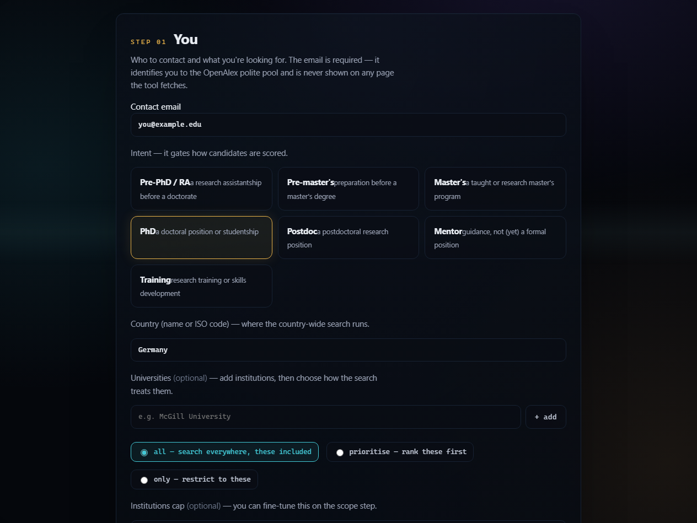
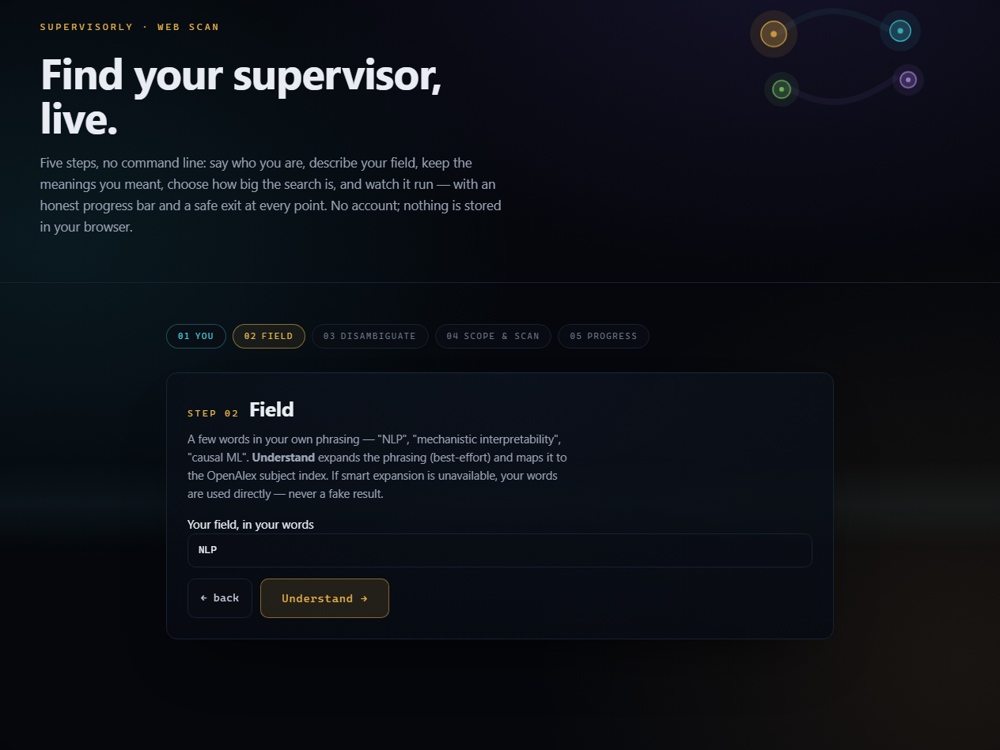
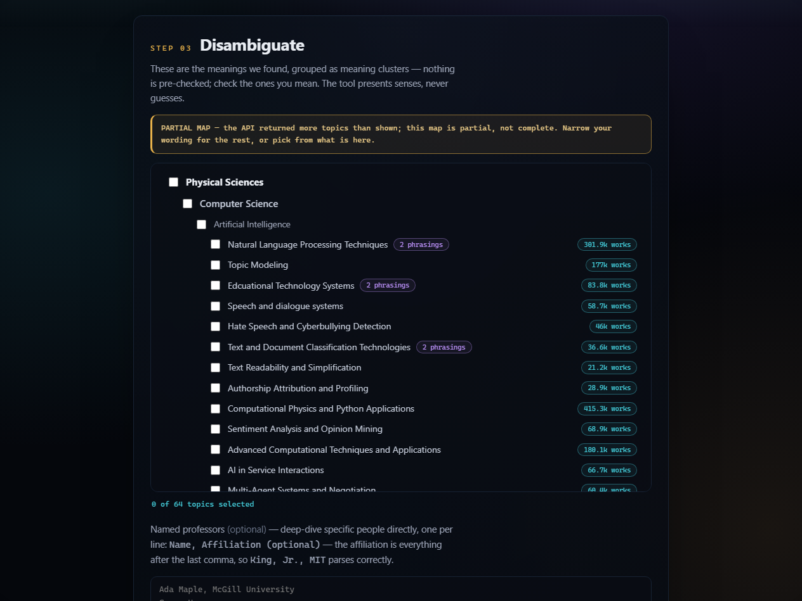
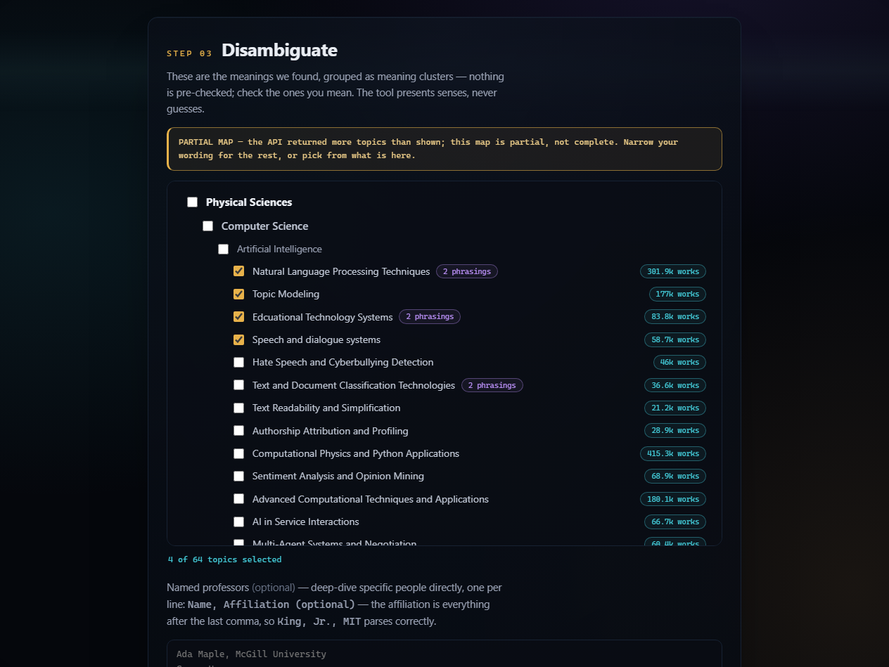
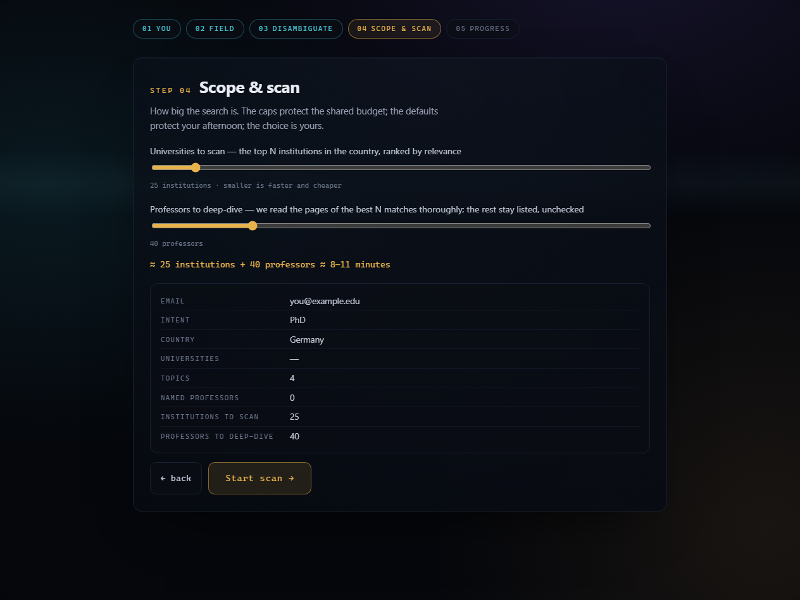
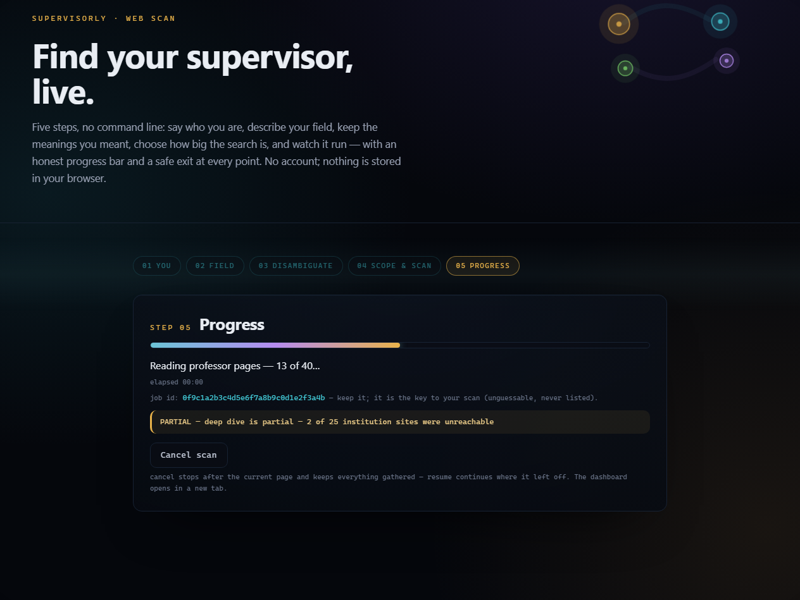
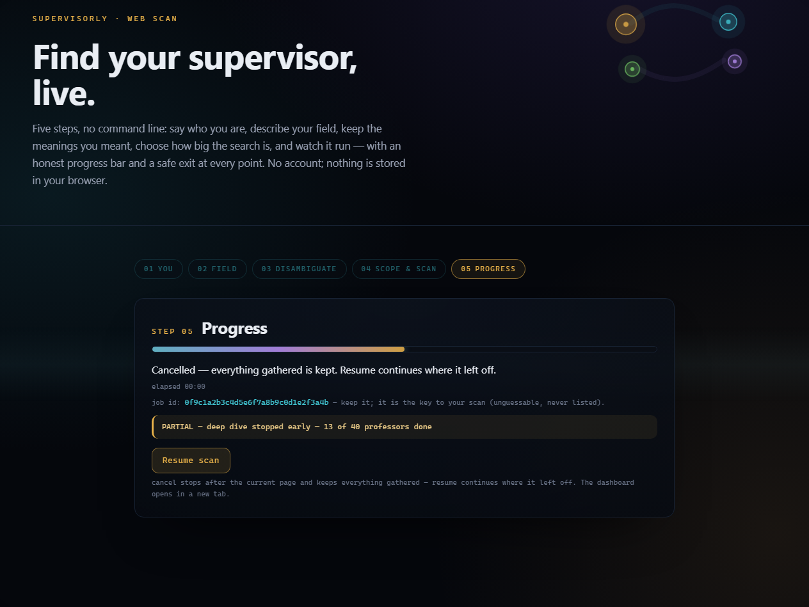
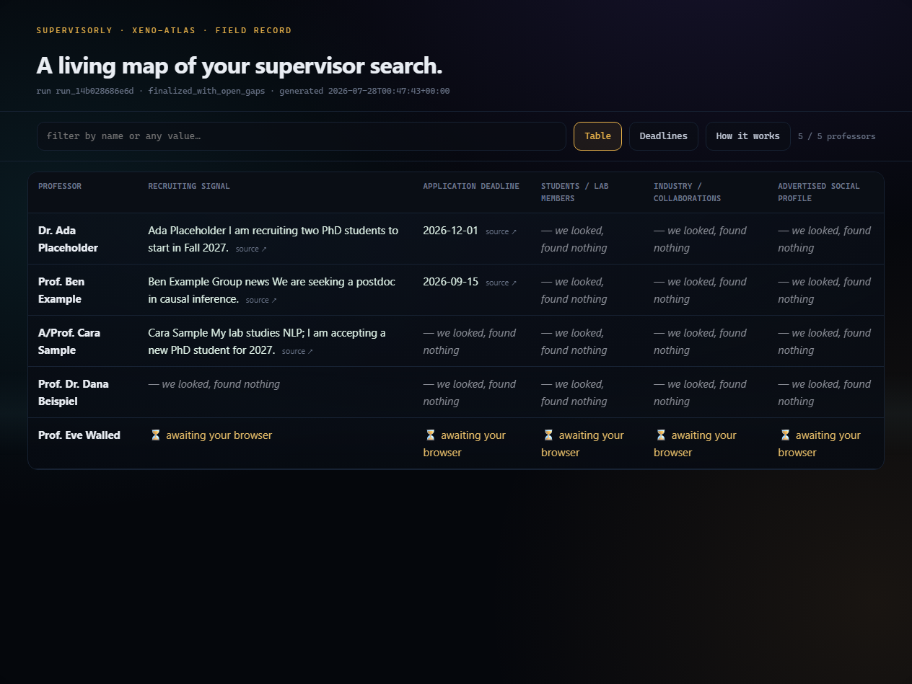

# Supervisorly — the complete user guide

**The live product: <https://supervisorly.web.app>**

This is one document that follows a real user from opening the page to holding a dashboard,
and — at every step — says exactly what the page calls, what comes back, what the limits
are, what can go wrong, and which module does the work. Every screenshot is from the live
site. Every number is read from the code, not remembered.

> **Two surfaces, one engine.** Everything below describes the **web app**. The same
> pipeline runs from the **Claude-Code skill / CLI** (see [`../README.md`](../README.md)),
> and neither surface can produce a fact the other could not — the web tier adds a job
> wrapper and an HTTP boundary, nothing more.

---

## Contents

1. [Keys — what I need from you](#1--keys--what-i-need-from-you)
2. [The 30-second version](#2--the-30-second-version)
3. [Step 0 — opening the page](#3--step-0--opening-the-page)
4. [Step 1 — You](#4--step-1--you)
5. [Step 2 — Field, and the *Understand* button](#5--step-2--field-and-the-understand-button)
6. [Step 3 — Disambiguate](#6--step-3--disambiguate)
7. [Step 4 — Scope & Scan](#7--step-4--scope--scan)
8. [Step 5 — Progress](#8--step-5--progress)
9. [Cancel and Resume](#9--cancel-and-resume)
10. [The dashboard](#10--the-dashboard)
11. [Full API reference](#11--full-api-reference)
12. [Limits, throttles and caps](#12--limits-throttles-and-caps)
13. [What can go wrong](#13--what-can-go-wrong)
14. [Privacy — what is stored, and for how long](#14--privacy--what-is-stored-and-for-how-long)
15. [Running it yourself](#15--running-it-yourself)
16. [What is *not* built](#16--what-is-not-built)

---

## 1 · Keys — what I need from you

**Status right now: nothing is needed. The product is live and fully working.**

| Key | Status | What happens without it |
|---|---|---|
| `SUPERVISORLY_CONTACT_EMAIL` | ✅ **set** | Nothing works — it identifies the tool to OpenAlex's polite pool (D-019) |
| `SUPERVISORLY_EXPAND_KEY` | ✅ **set** (Gemini, free tier) | Expansion fails closed; typing `NLP` finds **0 topics** instead of 64 |
| `SUPERVISORLY_OPENALEX_KEY` | ⬜ *optional, not set* | Nothing. It only raises the daily OpenAlex budget. The free polite pool is fine for personal use |

### 🔑 If you ever need to re-supply a key

Keys are **never** in the code, never in the page, and never in a request — they live in
Secret Manager and are read from server environment only ([D-068](DECISIONS.md#d-068--the-llm-may-generate-queries-never-claims)).
A test enforces that a caller cannot smuggle one in.

```bash
cd firebase
firebase functions:secrets:set SUPERVISORLY_EXPAND_KEY      # prompts; value never echoed
```

Then it must be **declared** on the functions that use it — a 2nd-gen function only
receives secrets it declares, and the failure is silent. See
[`../firebase/README.md`](../firebase/README.md) → *Query expansion*, which documents all
three traps that make a working key look broken.

---

## 2 · The 30-second version

```
    you ──▶ field ──▶ topics ──▶ scope ──▶ watch it run ──▶ dashboard
     1        2          3         4            5
                                            cancel ⇄ resume, any time
```

Five steps. No account, no password, nothing stored in your browser. A scan takes roughly
**8–11 minutes** at default scope. You can close the tab and come back with your job id.

---

## 3 · Step 0 — opening the page

Open **<https://supervisorly.web.app>**. That's it — no sign-up.

**What actually happens:** Firebase Hosting has no `index.html`, so a rewrite sends `/**`
to the `webapp` Cloud Function, which returns a single self-contained HTML document
(~54 KB) generated by
[`export/webapp.py`](../src/supervisorly/export/webapp.py) → `build_webapp()`.

It ships **no CDN, no fonts, no tracking, no external request of any kind**
([D-069](DECISIONS.md#d-069--the-hosted-web-product-honesty-privacy-and-user-control) §4) —
verified in production, not just asserted. First load may take **10–30 s** if the function
is cold; the page says so rather than looking broken.

---

## 4 · Step 1 — You



### What you fill in

| Field | Required | Notes |
|---|---|---|
| **Intent** | yes | `training · pre_master · pre_phd · mentor · master · phd · postdoc` — this changes the *hard eligibility gates* later, so a pre-PhD seeker is not judged on PhD-admission rules ([D-059](DECISIONS.md#d-059--hard-gates-are-intent-aware)) |
| **Country** | yes | Free text. Any country — nothing is hardcoded per country ([D-038](DECISIONS.md#d-038--queries-and-keywords-are-generated-per-search-never-looked-up)) |
| **Email** | yes | **Not a login.** No password, no account, no confirmation mail |

### Why it wants your email

Two honest reasons, both stated on the page:

1. It joins **OpenAlex's polite pool** — fetches identify themselves rather than scraping
   anonymously ([D-019](DECISIONS.md#d-019--legal-and-ethical-posture)).
2. It bounds you to **one active scan at a time**, so one person cannot flood a shared
   free API that everyone depends on.

It is stored on the job document, is never shown on any page the tool fetches, and is
deleted with the job after 7 days.

### No call is made yet

*Next* only runs client-side validation (`step1Next` → `validEmail`). A malformed address
shows an inline error; nothing is sent.

---

## 5 · Step 2 — Field, and the *Understand* button



Type your research field in plain words — `causal machine learning`, `robotics`, or just
`NLP`. Max **200 characters**.

### What pressing *Understand* actually does

Two calls, in order:

#### 5.1 `POST /api/expand`

```http
POST /api/expand
{ "field": "NLP" }
```

```json
{
  "variants": ["NLP", "natural language processing", "computational linguistics",
               "text mining", "artificial intelligence", "large language models"],
  "expanded": true,
  "note": ""
}
```

An LLM turns your phrasing into **search strings — never facts**
([D-068](DECISIONS.md#d-068--the-llm-may-generate-queries-never-claims)). It cannot invent
a professor, a deadline or a recruiting status: every fact still has to survive the quote
gate later. A wrong variant costs you nothing but a search that finds nothing.

**It fails closed.** No key, a timeout, a non-200, a malformed reply — all produce
`{"variants": ["<your words>"], "expanded": false, "note": "<short reason>"}` and the flow
continues. You are never blocked by the LLM being unavailable.

**Why it matters, measured on the live site:**

| You type | Topics found |
|---|---|
| `NLP` alone | **0** |
| after expansion (6 variants, merged) | **64** |

OpenAlex has no topic literally called "NLP". Without expansion an acronym is a dead end —
it fails *honestly* (the page says the map came back empty and offers to name professors
directly), but it finds nothing. A hardcoded acronym dictionary is forbidden by
[D-038](DECISIONS.md#d-038--queries-and-keywords-are-generated-per-search-never-looked-up);
generating variants is the sanctioned answer.

*Module:* [`discover/expand.py`](../src/supervisorly/discover/expand.py) → `expand_query()`
· *endpoint:* `webapi.handle_expand` · *throttle:* **10/hour per IP**

#### 5.2 `GET /api/map` — once per variant

```http
GET /api/map?field=natural%20language%20processing&email=you@example.edu
```

```json
{
  "query": "natural language processing",
  "groups": [
    { "domain": "Physical Sciences", "field": "Computer Science",
      "subfield": "Artificial Intelligence",
      "topics": [ { "topic_id": "T11714", "name": "Natural Language Processing Techniques",
                    "works_count": 12843 } ] }
  ],
  "truncated": true,
  "truncated_sources": ["openalex topics search 'natural language processing'"]
}
```

The page calls this **once per phrasing** and merges the results **in your browser** by
`topic_id`, tagging each topic with which phrasings found it
([D-070](DECISIONS.md#d-070--the-multi-phrasing-subject-map-merge-is-client-side)).

That is deliberate: if one phrasing fails, the click still succeeds and the page tells you
*"N phrasings could not be mapped — continuing with the rest."* A single merged server call
would have to drop the failure silently or fail as a whole.

**The cost, stated honestly:** each variant spends one unit of the 30/hour map budget, so
one *Understand* with 8 phrasings can cost 8. The trade-off is recorded in
[BLOCKERS.md B-001](BLOCKERS.md) with the trigger for revisiting it.

*Module:* [`discover/subjects.py`](../src/supervisorly/discover/subjects.py) →
`subject_map()` · *endpoint:* `webapi.handle_subject_map` · *throttle:* **30/hour per IP**

---

## 6 · Step 3 — Disambiguate



The merged subject map, as a checkbox tree grouped **domain → field → subfield**. This is
the step that stops the scan wasting ten minutes on the wrong meaning of your words.

- **Nothing is pre-checked.** The tool presents senses; it never guesses which you meant
  ([D-066](DECISIONS.md#d-066--the-subject-map-stage-field-understanding-is-api-derived-and-user-confirmed)).
- Checking a parent checks every topic under it.
- The amber **PARTIAL MAP** banner appears when OpenAlex returned more topics than shown —
  an honest "this list is not complete", not a silent truncation
  ([D-037](DECISIONS.md#d-037--per-professor-capture-is-dynamic-not-templated)).
- A topic found by several phrasings carries a **"N phrasings"** chip.



**You can skip this entirely** and name professors directly instead — useful when you
already know who you want to check.

**No network call happens here.** The tree is rendered from what step 2 already fetched.

---

## 7 · Step 4 — Scope & Scan



Where you decide how big and how long this is.

| Control | Range | Default | What it does |
|---|---|---|---|
| **Universities** | — | all | `all` · `prioritise` (rank yours first) · `only` (restrict to yours) |
| **Institution cap** | 1–300 | 25 | How many institutions to enumerate |
| **Shortlist** | 1–200 | 40 | How many professors get the expensive deep dive |
| **Named professors** | ≤100 | — | Scan specific people regardless of the topic search |

The **cost preview** updates live — *"≈ 25 institutions + 40 professors ≈ 8–11 minutes"*.
The wait is stated **before** it is spent, not discovered afterwards.

### Pressing *Start scan* — `POST /api/scan`

```http
POST /api/scan
{
  "email": "you@example.edu",
  "plan": {
    "intent_kind": "phd",
    "country": "Germany",
    "field": "NLP",
    "resolved_topic_ids": ["T11714", "T10181"],
    "university_mode": "all",
    "universities": [],
    "targets": []
  },
  "shortlist": 40,
  "max_institutions": 25
}
```

| Response | Meaning |
|---|---|
| `202 {"job_id": "0f9c…"}` | Started. **Keep this id** |
| `200 {"job_id": "…", "existing": true}` | You already started this exact scan — the same job is returned, not a duplicate |
| `400 {"error": "…"}` | A cap or a required key was violated; the message names the key |
| `429 {"error": "you already have an active scan job (…)"}` | One active scan per email |

**Double-click safe.** The button disables instantly *and* the server is idempotent: the
key is `(email, plan)`, so a refresh or a double submit returns the existing job
([`jobs.py`](../src/supervisorly/jobs.py) → `new_job_key`).

*Endpoint:* `webapi.handle_scan_start` · *throttle:* **5/hour per IP**

---

## 8 · Step 5 — Progress



The page polls **`GET /api/scan/<job_id>`** every **4 seconds** and narrates what is
actually happening.

```json
{
  "job_id": "0f9c1a2b…",
  "status": "running",
  "phase": "deep_dive_progress",
  "counts": { "targets": 120, "institutions": 25,
              "deep_dive_done": 13, "deep_dive_total": 40 },
  "progress": [ { "ts": "2026-07-28T00:12:03Z",
                  "phase": "deep_dive_progress", "data": [13, 40] } ],
  "heartbeat_age_s": 3,
  "warnings": ["deep dive is partial — 2 of 25 institution sites were unreachable"],
  "error": null,
  "result": null
}
```

> **Wire detail:** `data` is an **array**, not an object — the engine emits tuples
> `("deep_dive_progress", 13, 40)` and `jobs.py` stores `list(event[1:])`. The page reads
> `d[0]`/`d[1]`.

### The phases you will see

| Phase | Shown as |
|---|---|
| `discovering` | Finding universities and researchers in *your country*… |
| `enumerated` | Found *120* researchers across *25* institutions — picking the best matches |
| `deep_dive_start` | Reading the pages of the top *40* matches… |
| `deep_dive_progress` | Reading professor pages — *13* of *40*… |
| `gap_fill` | *N* pages need the slower path — filling what we can… |
| `scoring` | Ranking researchers and universities… |
| `exported` | Building your dashboard… |

### The honest states

- **Amber PARTIAL notes** appear *as they happen*, not at the end.
- **"Longer than expected"** appears rather than a frozen bar, if a phase overruns.
- **Lost contact** after 2 minutes of failed polls — with your job id, so you can come back.
- **Stalled worker** → the job flips to `failed` with *"worker stalled; safe to resume"*.
  Verified in production: a job stranded by a real permission failure was caught by the
  watchdog and resumed to completion.

### Job status values

```
queued ──▶ running ──▶ done
   │           │
   │           ├──▶ failed      ← resumable
   └──▶ cancelling ──▶ cancelled ← resumable
```

*Endpoint:* `webapi.handle_scan_status` · *throttle:* **3000/hour per IP** (the 4 s poll is
~900/hour for one tab — the cap is a runaway backstop, not a limit you can hit honestly)

---

## 9 · Cancel and Resume



**Cancel is not a kill.** `POST /api/scan/<id>/cancel` sets a cooperative flag; the engine
checks it *between units of work*, stops after the current page, and **exports what it
already gathered**. You lose nothing you had already paid for.

```
202 {"job_id": "0f9c…", "status": "cancelling"}
409 — the job already finished (nothing to cancel)
```

Then **Cancel is replaced by Resume**, and `POST /api/scan/<id>/resume` continues from the
engine's checkpoints with the *same* job id — not a restart.

```
202 {"job_id": "0f9c…", "status": "queued"}
409 — only a failed or cancelled job can be resumed
```

**Every terminal state is resumable — `done`, `failed`, `cancelled`.** There is no dead end
by design ([D-069](DECISIONS.md#d-069--the-hosted-web-product-honesty-privacy-and-user-control) §5),
and the full cancel → cancelled → resume → done cycle is verified against the live
deployment.

> ⏳ **One thing to expect:** cancelling a *queued* job can sit in `cancelling` for up to
> ~2 minutes. The worker container has to finish cold-starting before it can see the flag.
> It is not stuck.

*Throttles:* cancel **60/hour**, resume **5/hour** (a resume launches a worker, so it costs
the same as a scan).

---

## 10 · The dashboard

When `status` becomes `done`, **Open dashboard** calls `GET /api/result/<id>`, which
returns `302` to a **15-minute signed URL**, re-minted on every request so an expired link
is never a dead end.



*(Screenshot from the synthetic demo fixture — "Ada Placeholder", "Eve Walled" — so no real
person's data appears in this repo.)*

### The four states, never conflated

This is the heart of the product
([D-022](DECISIONS.md#d-022--the-flagship-field-is-20-populated-and-the-product-must-say-so) /
[D-037](DECISIONS.md#d-037--per-professor-capture-is-dynamic-not-templated) /
[D-046](DECISIONS.md#d-046--the-json-export-contract-is-the-systems-interchange-format-with-a-four-state-value-envelope)):

| State | Shown as | Means |
|---|---|---|
| **value** | the fact, with a `source ↗` link | Found, quoted, verified against the page |
| **searched_absent** | *"— we looked, found nothing"* | We checked and it genuinely is not there |
| **never_attempted** | blank / not reached | We did not get to it |
| **blocked** | *"⏳ awaiting your browser"* | Login-walled — needs your own session |

A professor is **never dropped for missing data**. An empty column is information, not a
gap in the table.

Every value carries a **quote that was verified present in the stored snapshot** — a claim
whose quote is not found is *rejected in code before it is written*
([D-010](DECISIONS.md#d-010--every-field-carries-provenance-and-confidence)). That is the anti-hallucination
guarantee, and it is a code control rather than a prompt instruction.

### What else is in there

- **Deadlines view** — cross-professor "what closes soon", with the domestic/international
  split, and an `.ics` export. A projected deadline is a **watch date, never a firm one**.
- **Filter box** — across every field.
- **How it works** — the pipeline, in the dashboard itself.
- A sibling **`dashboard.json`** with the same data, so your Claude session can read it and
  edit the UI ([D-041](DECISIONS.md#d-041--the-dashboard-is-claude-interactive)).

---

## 11 · Full API reference

Base: `https://supervisorly.web.app`. Every route: JSON, CORS-enabled, method-checked,
stack-free errors, rate-limited per client IP.

| # | Method | Path | Body / params | Success | Errors |
|---|---|---|---|---|---|
| 1 | `GET`·`POST` | `/api/expand` | `field` | `200 {variants[], expanded, note}` | never fails — falls back to your words |
| 2 | `GET`·`POST` | `/api/map` | `field`, `email`, `max_results` 1–100 (25) | `200 {query, groups[], truncated, truncated_sources[]}` | `400` bad field/email/max_results · `500` upstream |
| 3 | `POST` | `/api/scan` | `{email, plan, shortlist?, max_institutions?}` | `202 {job_id}` · `200 {job_id, existing:true}` | `400` caps · `429` active job · `503` no store |
| 4 | `GET` | `/api/scan/<id>` | — | `200 {status, phase, counts, progress[], warnings[], error, result}` | `404` unknown id |
| 5 | `POST` | `/api/scan/<id>/cancel` | — | `202 {status:"cancelling"}` | `404` · `409` already terminal |
| 6 | `POST` | `/api/scan/<id>/resume` | — | `202 {status:"queued"}` | `404` · `409` not failed/cancelled |
| 7 | `GET` | `/api/result/<id>` | — | `302` → 15-min signed URL | `404` · `409` not ready yet |

**Wrong method → `405`.** Not a silent no-op: `GET /scan_cancel?id=…` used to be a working
state change, which made it CSRF-able from an `` tag. Now every route enforces its verb.

### The plan contract

Required keys — a plan missing any is rejected **loudly with the full expected list**, never
silently defaulted:

```
intent_kind · country · resolved_topic_ids · field · university_mode · universities
```

| Key | Valid values |
|---|---|
| `intent_kind` | `training` `pre_master` `pre_phd` `mentor` `master` `phd` `postdoc` |
| `university_mode` | `all` `prioritise` `only` |

---

## 12 · Limits, throttles and caps

### Per-IP throttles (fixed hourly window)

| Endpoint | Limit | Why that number |
|---|---|---|
| `/api/expand` | **10/h** | Each call costs an LLM request |
| `/api/map` | **30/h** | Each call costs an OpenAlex request; one *Understand* can spend up to 8 |
| `POST /api/scan` | **5/h** | Each launches a worker that can run for hours |
| `/api/scan/<id>/resume` | **5/h** | Also launches a worker — its own bucket, so scans don't block resumes |
| `/api/scan/<id>/cancel` | **60/h** | Cheap, but state-changing |
| `/api/result/<id>` | **120/h** | Each mints a signed URL |
| `GET /api/scan/<id>` | **3000/h** | A Firestore read. The page polls every 4 s ≈ 900/h per tab — this is a runaway-bill backstop, not a real limit |

Over the limit → `429` with an honest message naming the endpoint's allowance.

### Server-side caps on a plan

| Cap | Value |
|---|---|
| plan JSON | 64 KB |
| `field` | 200 chars |
| `resolved_topic_ids` | 25 |
| `universities` | 50 |
| `targets` (named professors) | 100 |
| `shortlist` | 1–200 |
| `max_institutions` | 1–300 |
| active scans per email | **1** |
| worker runtime | 6 hours |

### Client-side timings

| Constant | Value |
|---|---|
| status poll | 4 s |
| request timeout | 45 s (cold-start friendly) + one retry |
| "lost contact" after | 2 min of failed polls |

---

## 13 · What can go wrong

| What you see | What it means | What to do |
|---|---|---|
| First click takes 10–30 s | Cold start — the function was asleep | Wait; the page says so |
| **"The subject map came back empty"** | No topic matched your words | Rephrase, or name professors directly |
| **PARTIAL MAP** banner | More topics exist than shown | Narrow your wording, or pick from what's there |
| **"N phrasings could not be mapped"** | Some variants failed; the rest worked | Nothing — it continued |
| `429` "too many requests" | You hit an hourly throttle | Wait for the hour to roll over |
| `429` "you already have an active scan" | One scan per email | Cancel the running one, or wait |
| **"Longer than expected"** | A phase is overrunning | It is still working; cancel is available |
| **"Lost contact"** | 2 min of failed polls | Your job id is shown — reload and resume by id |
| **"worker stalled; safe to resume"** | The watchdog caught a dead worker | Press **Resume** |
| **"⏳ awaiting your browser"** in results | A login-walled source | Use the CLI browser tier, or accept the honest gap |

---

## 14 · Privacy — what is stored, and for how long

Scan results are **personal data about real people who did not ask to be in your search**,
and the design treats them that way ([D-005](DECISIONS.md#d-005--scan-output-is-never-committed) /
[D-069](DECISIONS.md#d-069--the-hosted-web-product-honesty-privacy-and-user-control)):

| | |
|---|---|
| **In your browser** | **Nothing.** No cookies, no localStorage, no plan, no email |
| **Your job id** | Is the credential. A random 128-bit value — jobs are **never listable**, and Firestore denies client reads outright, so the id opens the filtering endpoint, not the raw document |
| **Job document** | Your email + plan + progress. Auto-deleted **7 days** after last write |
| **Results** | A **private** bucket — public access prevention *enforced*, verified: fetching the object without a signature returns **403**. Auto-deleted after 7 days |
| **Result links** | 15-minute signed URLs, re-minted per request |
| **Opt-out** | Anyone in `optout.txt` is filtered at build, re-checked mid-scan and at re-export, with a test that fails if one survives |
| **robots.txt** | Obeyed, fail-closed, re-checked after redirects |
| **Never exported** | LLM judgements about individuals; bare email lists ([D-024](DECISIONS.md#d-024--evaluative-judgements-about-individuals-stay-local-and-unexported)) |
| **No bulk outreach** | One professor at a time. There is no mass-email path, by design |

---

## 15 · Running it yourself

### The CLI (no cloud, no keys but an email)

```bash
python -m venv .venv
.venv\Scripts\activate                 # Windows
python -m pip install -e ".[dev]"

python -m supervisorly scan --demo --out output/demo.html          # offline, synthetic
python -m supervisorly scan --country Germany --field "causal ML" \
       --email you@example.com --out output/live.html --resume     # live
```

### The web app locally — **two** commands

The dev server serves the **API only**; the page is a generated artifact:

```bash
python -m supervisorly.webapi --port 8765

python -c "from supervisorly.export.webapp import build_webapp; \
  print(build_webapp(api_base='http://localhost:8765'))" > output/webapp.html
```

Then open `output/webapp.html`. (Deployed, this second step is unnecessary — Hosting serves
the page from the same origin.)

### Deploying your own copy

[`../firebase/README.md`](../firebase/README.md) — an 8-step runbook, with every trap that
cost real time written down: the service account that doesn't exist, the privacy flag whose
comment says the opposite of what it does, `run.invoker` not being enough to launch a job
with overrides, and the signed-URL path needing IAM signBlob explicitly.

---

## 16 · What is *not* built

Stated plainly, because a guide that only lists what works is a sales page.

| Gap | Status |
|---|---|
| **Stage 4 — "people around the professor"** | **Not built.** `recent_collaborators` and `former_doctoral_students` are specified but no module implements them, and two documents disagree on whether they may be exported. Blocked on a decision — [BLOCKERS.md B-002](BLOCKERS.md) |
| **6-hour worker timeout** | Never exercised — no scan has run that long |
| **7-day TTL deletes** | Configured and verified as policy; not yet observed firing (needs seven days) |
| **Throttles under real concurrency** | Verified per-endpoint, never under genuine parallel load |
| **A budget-scale scan** | Every live scan so far was deliberately tiny (2 institutions, shortlist 3) |
| **App Check** | Not enabled. Throttles are the only abuse control, and they are per-IP |

---

*Every screenshot here is from the live deployment; the dashboard is the synthetic demo
fixture so no real person appears. If the product and this guide ever disagree, the product
is right and the guide is a bug — please say so.*
