# Supervisorly — Design Atlas

One place that connects everything: the two entry surfaces (the skill and the hosted web app),
its agents and tools, the two run modes, the scan-setup flow from free text to a confirmed plan,
the pipeline, the fetch ladder with its browser tier and human-rung fallback, the hosted job
lifecycle, the data model, the claim/provenance lifecycle, the rules, and how the 70 decisions
cluster. Each map ends with the documents and decisions that govern it.

**Colour key** — the diagrams use one consistent scheme:

| Colour | Means |
|---|---|
| **Indigo** | the tool fetches or does this automatically |
| **Violet** | the browser tier — your own session, driven by the agent |
| **Rose** | the human rung — the classic MD method (Claude for Chrome), now the fallback |
| **Grey** | skipped on purpose |
| **Amber** | a data store or artifact |
| **Green** | verified / reliable |
| **Teal** | a rule / enforcement gate |
| **Blue-violet** | the hosted web tier — page, API, job (D-069) |

---

## CONTEXT — the boundary of the tool

What Supervisorly is, and where the line runs between what the tool does, what the
agent-driven browser does in your session, and what still falls back to you.

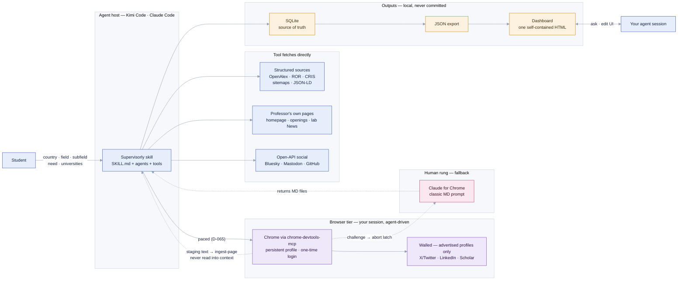

*The tool reads public pages and open APIs; it never defeats a login. Everything walled is
reached through your own logged-in session — agent-driven Chrome first, the classic MD rung
as the fallback. The recipe is host-portable: the browser is an MCP server, the seam is the
CLI.* — architecture.md · D-039 · D-042 · D-044 · D-064

---

## MODES — offline demo vs live

Two ways in. The demo proves the whole pipeline offline against a synthetic cassette; a live
scan needs only a contact email — ROR is keyless, an OpenAlex key just raises limits, and the
browser tier supplies your logged-in session for the walled pages.

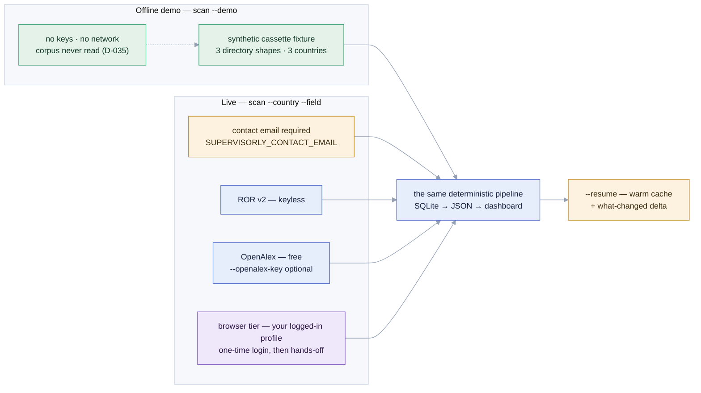

*The demo is the genericity fixture too — three directory shapes across three countries, all
synthetic. Live credentials stay minimal on purpose: an email for the polite pools, nothing
else.* — demo.py · preflight.py · SKILL.md · D-064

---

## COMPONENTS — skill, tools, and agents

The deliverable is a skill package — plus, since D-069, a hosted web surface over the same
tools. `SKILL.md` orchestrates deterministic **tools** (no LLM) and, where genuine judgement is
needed, **agents** (LLM). Everything writes to SQLite; nothing returns prose to the
orchestrator. The web tier (violet-blue) wraps the identical tool chain in a job and an HTTP
boundary; it adds no new way for a fact to enter the system.

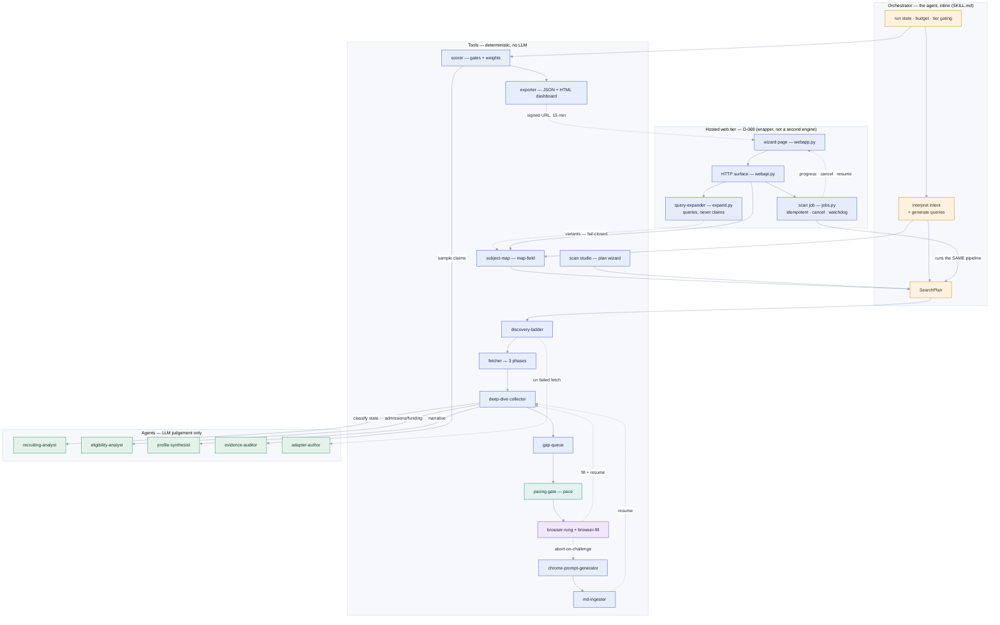

*Intent interpretation and query generation are done by the orchestrator inline — they are the
"generate, don't look up" judgement — producing a SearchPlan the deterministic tools consume.
The browser seam (pace → browser-rung → browser-fill) is the default walled path; the
chrome-prompt-generator + md-ingester pair is the classic human rung it falls back to. Agents
are defined by what needs judgement; workers return a task id and status, never prose. On the
hosted surface there is no orchestrator to interpret intent, so the wizard assembles the same
SearchPlan from explicit choices — assisted by subject-map and the query-expander, which
produce searches, never facts, so D-045's boundary is preserved rather than crossed.* —
architecture.md §4, §11 · D-042 · D-045 · D-055 · D-064 · D-065 · D-066 · D-067 · D-068 · D-069

---

## SCAN SETUP — from free text to a confirmed plan

Nothing expensive runs before the student confirms the plan. The free-text field becomes an
API-derived subject map; the student multi-selects topics — in the Scan Studio's checkbox
tree, or as a numbered list in conversation — and the confirmed plan (or a file of named
professors) drives the scan.

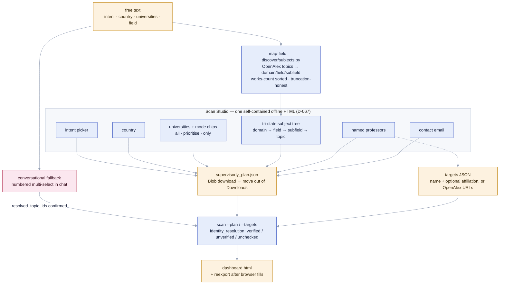

*Selected topic IDs become the plan's `resolved_topic_ids`, so research-fit is deterministic
ID-overlap, not string match. The Studio is a static file — it cannot write to disk, so the
plan arrives as a browser download; the conversational numbered list remains the fallback in
every agent host. Unresolved named professors are reported as skips, never silently dropped.* —
discover/subjects.py · export/studio.py · scan --help · D-058 · D-066 · D-067

---

## PIPELINE — the student's journey, in stages

Intent is understood before anything is searched. The shortlist is formed on **research fit**
(cheaply available), not on recruiting status (which only exists after the deep dive).

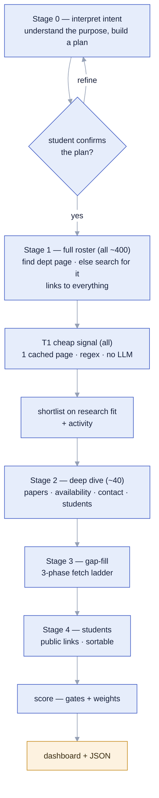

*A professor is never dropped for missing data — the gap is shown, not hidden. Stage 0's plan
confirmation is now concrete: the subject map (SCAN SETUP map) is the review.* —
product-flow.md · D-021 · D-022 · D-037 · D-066

---

## WEB — the hosted surface: one job, watched and stoppable

The same pipeline, for a student who will not open a terminal (D-069). The wizard assembles a
plan, the API starts a **job**, a worker runs the identical scan, and the page narrates it. Every
terminal state is resumable, so there is no dead end.

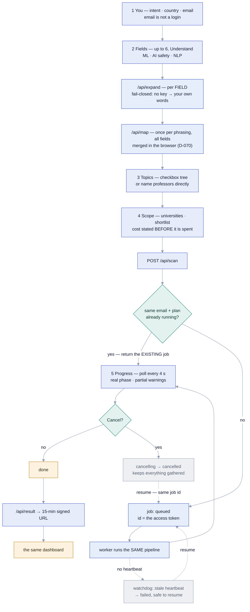

*The job id is the access token — jobs are never listable, and Firestore denies client reads
outright, so the id opens our filtering endpoint, not the raw document (which holds the email and
the plan). Cancel is cooperative, not a kill: the engine stops between units of work and exports
what it has. A double-click cannot start a second scan, and a dead worker becomes an honest
`failed` rather than a job spinning forever. Results are personal data: private bucket, 15-minute
signed URLs re-minted per request, deleted after seven days.* —
architecture.md §11 · product-flow.md · D-005 · D-037 · D-068 · D-069 · D-070

---

## FETCH — three phases, the browser tier, and the human-rung fallback

Each phase runs across the target set, marks its failures, and hands only the residual to the
next. Phase 3 is now the agent-driven browser tier (D-064); the original Chrome-extension
method — turned into the classic MD human rung — remains as the fallback when the browser is
denied or challenged.

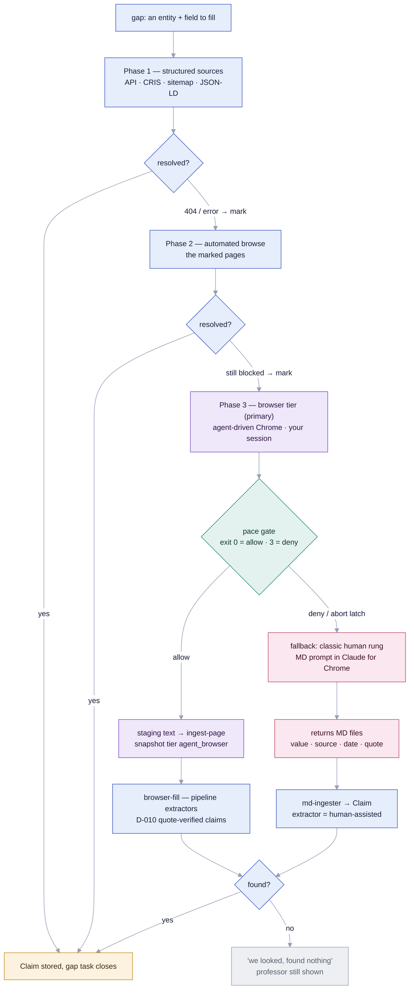

*The run carries an `awaiting_human_input` status so gap-filling can span sessions and resume
without re-fetching — `ingest-page --entity … --run …` fills a target from a browser page and
closes its gap tasks, then `reexport` rebuilds the dashboard.* —
architecture.md §2 · D-039 · D-043 · D-064 · D-065

---

## BROWSER TIER — the D-064/D-065 recipe, page by page

The exact loop for every browser page. **Raw HTML/DOM never enters the agent's context** —
extraction happens in-page and in Python; the agent handles only file paths, byte counts, and
one-line results. A browser page is just another snapshot.

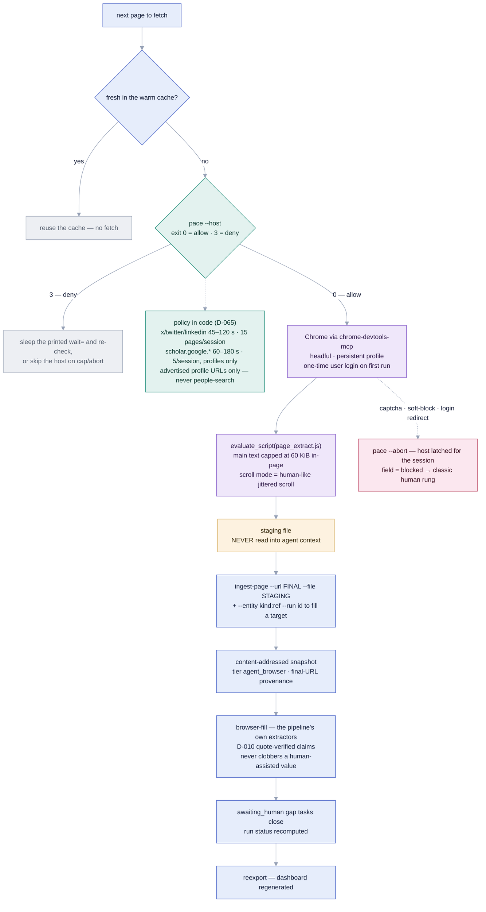

*The Python layer stays LLM-free: browser-collected content enters the engine only through the
deterministic `ingest-page` seam, and the existing extractors plus the quote-in-snapshot gate
run unchanged. State lives at `~/.supervisorly/pacing_state.json` so caps and abort latches
survive the working directory.* — SKILL.md (browser recipe) · fetch/browser_rung.py ·
fetch/browser_fill.py · ethics/pacing.py · D-009 · D-010 · D-064 · D-065

---

## SOURCES — where recruiting signal comes from

Recruiting status lives in prose on the professor's own channels. Everything reachable feeds
one generated recruiting-signal read; the walled profiles are read through your own paced
session.

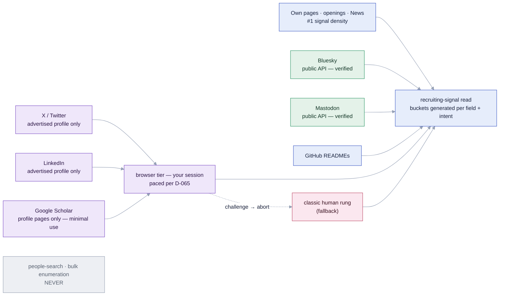

*The reading method — which phrases signal recruiting, how negation and cycle-dating are
handled — is generated, never a hardcoded keyword list. Only the profile URL the professor
themselves advertised is ever visited; on any challenge the field goes `blocked` and routes to
the human rung.* — research/social-sources.md · D-038 · D-044 · D-065

---

## DATA — the core of the model

The spine that lets facts join, dedupe and diff — the thing the corpus's prose files could not
do. 32 entities in total (24 world-model + 8 pipeline/user-action, the eighth being the hosted
`Job`, D-069); the core is shown.

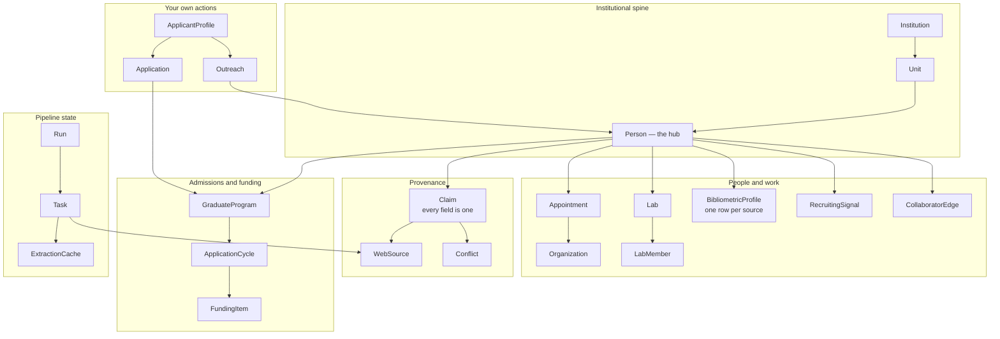

*Nothing is keyed on a display name; identity is an internal id with external ids as evidence.
Bibliometrics is one row per source — never a blended number.* — domain-model.md · D-026 · D-030

---

## PROVENANCE — how a value becomes a trusted claim

Every fact carries its source, its quote, and its confidence. Verification is structural — the
model's quote must be found in the stored snapshot — not a prose promise.

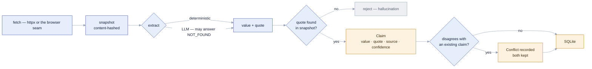

*Verification proves fidelity, not truth — that the model didn't invent text relative to the
page. The page itself can still be wrong or stale. A browser-tier page is just another
snapshot: tier `agent_browser`, final-URL provenance, same quote gate.* —
architecture.md §3 · D-010 · D-043 · D-064

---

## RULES — where each rule actually bites

Rules are enforced in code at specific points, not asserted in a preamble. This is the map of
enforcement gates.

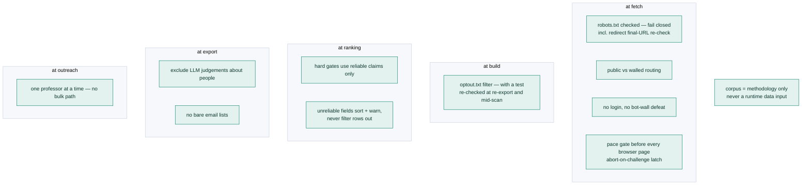

*Nationality never gates visibility. Scale is an ethical constraint, not just a performance
one. The pacing rules are code, not vibes — a deny or an abort latch is never retried harder.* —
ethics-and-compliance.md · D-005 · D-023 · D-024 · D-032 · D-035 · D-065

---

## DECISIONS — how the 70 cluster

Every decision belongs to one of nine themes. This shows the shape of the design space, and
which clusters still carry the most risk. (70 decisions after the hosted-web round; the map
names representative ones per theme, not all.)

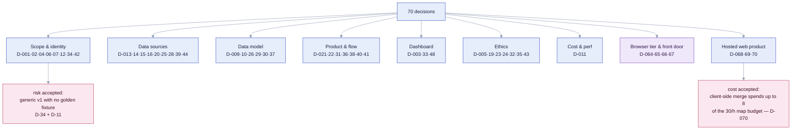

*The one flagged risk: fully-generic v1 (D-034) without a corpus-sourced regression fixture
(D-011/D-035). Managed by fail-loud coverage, per-value confidence, and cassette + synthetic
tests. The hosted round added one accepted cost rather than a risk: the client-side merge
(D-070) trades throttle budget for honest per-phrasing failure, with the revisit trigger written
down in BLOCKERS.md B-001.* — DECISIONS.md · BLOCKERS.md

---

*This atlas is a view over the design documents, not a replacement for them. When a diagram and
a document disagree, the document wins — tell me and I'll fix the diagram.*

## WHERE IT LIVES — every node, mapped to the code

Every map above is a picture of something that exists. This is the index from the picture to the code — **machine-verified**: the build checks that each file exists and that each symbol is really defined in it, so a rename breaks the check rather than quietly rotting the atlas. `atlas.html` shows the same mapping in its side panel when you click a node.

### Plan & setup

| Node | Lives in | Note |
|---|---|---|
| **supervisorly skill** | `.claude/skills/supervisorly/SKILL.md` — | the orchestrator skill |
|  | `tests/test_skill_contracts.py` — | asserts the skill contract |
| **searchplan** | `src/supervisorly/cli.py` `PLAN_REQUIRED_KEYS` | the required keys |
|  | `src/supervisorly/cli.py` `_plan_value_errors` | fail-loud validation |
|  | `src/supervisorly/cli.py` `_load_plan` | load, never silently default |
| **interpret intent** | `src/supervisorly/cli.py` `PLAN_INTENT_KINDS` | the accepted intents |
|  | `src/supervisorly/score/scorer.py` `gates_for` | intent selects the hard gates |
| **map field** | `src/supervisorly/cli.py` `cmd_map_field` | the map-field command |
|  | `src/supervisorly/discover/subjects.py` `subject_map` | builds the topic hierarchy |
| **scan studio** | `src/supervisorly/export/studio.py` `build_studio` | the self-contained wizard |
|  | `src/supervisorly/cli.py` `cmd_studio` | the studio command |
| **subject tree** | `src/supervisorly/discover/subjects.py` `subject_map` | domain to field to subfield |
|  | `src/supervisorly/export/studio.py` `build_studio` | renders it as a checkbox tree |
| **named professors** | `src/supervisorly/cli.py` `_resolve_named_targets` | names to OpenAlex authors |
| **targets json** | `src/supervisorly/cli.py` `_load_target_specs` | the --targets file |
| **scan plan** | `src/supervisorly/cli.py` `cmd_scan` | merges plan, targets and flags |
| **supervisorly plan** | `src/supervisorly/cli.py` `_load_plan` | the plan JSON contract |
| **offline demo** | `src/supervisorly/demo.py` `demo_fixture` | cassettes + a synthetic plan |
|  | `src/supervisorly/pipeline.py` `run_offline` | the offline path |
| **live scan** | `src/supervisorly/pipeline.py` `run_live` | the live run entry point |
|  | `src/supervisorly/cli.py` `cmd_scan` | builds the plan, calls run_live |
| **contact email** | `src/supervisorly/preflight.py` `CONTACT_EMAIL_ENV` | SUPERVISORLY_CONTACT_EMAIL |
|  | `src/supervisorly/preflight.py` `require_credentials` | refuses to run without it |

### Discovery & fetch

| Node | Lives in | Note |
|---|---|---|
| **discovery-ladder** | `src/supervisorly/discover/ladder.py` `build_targets` | one round, end to end |
|  | `src/supervisorly/discover/ladder.py` `enumerate_professors` | authors per institution |
|  | `src/supervisorly/discover/ladder.py` `select_institutions` | honours university_mode |
| **fetcher** | `src/supervisorly/fetch/fetcher.py` `Fetcher` | robots-gated, paced, snapshotting |
|  | `src/supervisorly/fetch/fetcher.py` `FetchResult` | allowed / status / snapshot hash |
| **deep-dive** | `src/supervisorly/pipeline.py` `_deep_dive_one` | one target: fetch, extract, claim |
|  | `src/supervisorly/pipeline.py` `_process_targets` | the loop over targets |
| **gap-queue** | `src/supervisorly/model/runs.py` `incomplete_tasks` | open gap tasks per run |
|  | `src/supervisorly/pipeline.py` `_target_open_gap` | derives gaps from claims |
| **signal tier** | `src/supervisorly/pipeline.py` `run_signal_extractors` | one cheap page each |
|  | `src/supervisorly/pipeline.py` `extract_recruiting_signal` | regex, no LLM |
| **shortlist gate** | `src/supervisorly/pipeline.py` `_apply_shortlist` | top-N on research fit |
|  | `src/supervisorly/pipeline.py` `DEFAULT_SHORTLIST_SIZE` | 40 by default |
| **warm cache** | `src/supervisorly/model/extraction_cache.py` `lookup` | the four-tuple cache key |
|  | `src/supervisorly/model/runs.py` `target_stage_done` | resume skips finished work |
| **phase 1** | `src/supervisorly/model/runs.py` `TASK_PHASES` | the canonical phase enum |
|  | `src/supervisorly/fetch/fetcher.py` `Fetcher` | structured/API + direct fetch |
| **phase 2** | `src/supervisorly/fetch/browser_fill.py` `fill_from_browser_page` | the browser tier consumer |
| **phase 3** | `src/supervisorly/extract/chrome_prompt.py` `generate_prompt` | the human-rung emitter |
|  | `src/supervisorly/ingest.py` `ingest_md` | parses the returned MD |

### Browser tier & human rung

| Node | Lives in | Note |
|---|---|---|
| **pacing gate** | `src/supervisorly/ethics/pacing.py` `check` | allow or deny, per host |
|  | `src/supervisorly/ethics/pacing.py` `POLICY` | intervals and caps as data |
|  | `src/supervisorly/cli.py` `cmd_pace` | exit 3 means wait or deny |
| **pace gate** | `src/supervisorly/ethics/pacing.py` `check` | the gate itself |
|  | `src/supervisorly/ethics/pacing.py` `classify` | host class by suffix |
| **pace abort** | `src/supervisorly/ethics/pacing.py` `abort` | latches the host, never retried |
| **policy in code** | `src/supervisorly/ethics/pacing.py` `POLICY` | the rules are data, not vibes |
|  | `src/supervisorly/ethics/pacing.py` `_record_fetch` | pins the jittered instant |
| **ingest page** | `src/supervisorly/fetch/browser_rung.py` `ingest_page` | agent text becomes a snapshot |
|  | `src/supervisorly/fetch/browser_rung.py` `SOURCE_TIER` | the agent_browser tier |
|  | `src/supervisorly/cli.py` `cmd_ingest_page` | the CLI seam |
| **browser rung** | `src/supervisorly/fetch/browser_rung.py` `ingest_page` | the snapshot seam |
|  | `src/supervisorly/fetch/browser_fill.py` `fill_from_browser_page` | the consumer half |
| **browser fill** | `src/supervisorly/fetch/browser_fill.py` `fill_from_browser_page` | runs the real extractors |
|  | `src/supervisorly/pipeline.py` `BROWSER_FILL_FIELDS` | what a browser page may fill |
| **reexport** | `src/supervisorly/pipeline.py` `reexport` | rebuild with no fetching |
|  | `src/supervisorly/cli.py` `cmd_reexport` | the reexport command |
| **chrome-prompt-generator** | `src/supervisorly/extract/chrome_prompt.py` `generate_prompt` | the shared MD grammar |
| **md-ingester** | `src/supervisorly/ingest.py` `ingest_md` | MD back into claims |
|  | `src/supervisorly/extract/md_grammar.py` — | the shared MD grammar |

### Model, claims & export

| Node | Lives in | Note |
|---|---|---|
| **sqlite** | `src/supervisorly/model/schema.sql` — | the schema — source of truth |
|  | `src/supervisorly/model/db.py` `open_db` | connect and migrate |
| **claim** | `src/supervisorly/model/claims.py` `record_claim` | the quote gate lives here |
|  | `src/supervisorly/fetch/normalize.py` `quote_in_snapshot` | the actual quote check |
| **snapshot** | `src/supervisorly/fetch/snapshot.py` `SnapshotStore` | content-addressed on disk |
|  | `src/supervisorly/fetch/normalize.py` `content_hash` | volatile chrome masked first |
| **conflict** | `src/supervisorly/model/conflicts.py` `detect_for_claim` | records the disagreement |
|  | `src/supervisorly/model/conflicts.py` `decide` | the deterministic policy |
|  | `src/supervisorly/model/schema.sql` `conflict` | both claims kept |
| **scorer** | `src/supervisorly/score/scorer.py` `score_professor` | weighted components |
|  | `src/supervisorly/score/scorer.py` `evaluate_eligibility` | the hard gates |
| **exporter** | `src/supervisorly/export/json_export.py` `build_export` | the four-state envelope |
|  | `src/supervisorly/export/dashboard.py` `build_dashboard` | the self-contained HTML |
| **we looked** | `src/supervisorly/export/json_export.py` `build_export` | searched_absent is a real value |

### Ethics

| Node | Lives in | Note |
|---|---|---|
| **robots** | `src/supervisorly/fetch/robots.py` `is_allowed` | rule matching, fail-closed |
|  | `src/supervisorly/fetch/fetcher.py` `Fetcher` | re-checks the redirect target |
| **optout** | `src/supervisorly/ethics/optout.py` `filter_targets` | drops opted-out records |
|  | `src/supervisorly/ethics/optout.py` `load_optout` | reads optout.txt |
| **corpus** | `tests/test_ethics.py` `CORPUS_MARKERS` | the forbidden path markers |
|  | `tests/test_ethics.py` `test_corpus_path_is_never_referenced_in_code` | the enforcing test |

### Agents

| Node | Lives in | Note |
|---|---|---|
| **recruiting-analyst** | `.claude/agents/recruiting-analyst.md` — | the agent contract |
| **eligibility-analyst** | `.claude/agents/eligibility-analyst.md` — | the agent contract |
| **profile-synthesist** | `.claude/agents/profile-synthesist.md` — | the agent contract |
| **evidence-auditor** | `.claude/agents/evidence-auditor.md` — | the agent contract |
| **adapter-author** | `.claude/agents/adapter-author.md` — | the agent contract |

### Hosted web tier

| Node | Lives in | Note |
|---|---|---|
| **the email is not a login** | `src/supervisorly/export/webapp.py` `build_webapp` | step 1 of the wizard |
|  | `src/supervisorly/webapi.py` `handle_scan_start` | one active job per email |
| **api/expand** | `src/supervisorly/discover/expand.py` `expand_query` | fail-closed by construction |
|  | `src/supervisorly/webapi.py` `handle_expand` | key from server config only |
|  | `firebase/_core.py` `handle_expand` | adds the cache + throttle |
| **api/map** | `src/supervisorly/webapi.py` `handle_subject_map` | takes ONE field |
|  | `src/supervisorly/export/webapp.py` `build_webapp` | mergeMaps merges in the page |
| **cost stated before** | `src/supervisorly/export/webapp.py` `build_webapp` | costEstimate in the page |
|  | `src/supervisorly/webapi.py` `_plan_cap_errors` | the server-side caps |
| **already running** | `src/supervisorly/jobs.py` `new_job_key` | the idempotency key |
|  | `src/supervisorly/webapi.py` `handle_scan_start` | returns the existing job |
|  | `firebase/_core.py` `FirestoreJobStore` | the create race, transactional |
| **the id is the access token** | `src/supervisorly/webapi.py` `handle_scan_status` | by id, never listable |
|  | `firebase/firestore.rules` — | clients get no read at all |
| **worker runs the same pipeline** | `firebase/worker.py` `main` | the Cloud Run entrypoint |
|  | `src/supervisorly/jobs.py` `run_scan_job` | wraps the same run_live |
|  | `src/supervisorly/pipeline.py` `run_live` | the identical engine |
| **poll every 4** | `src/supervisorly/export/webapp.py` `build_webapp` | POLL_MS, renderStatus |
|  | `src/supervisorly/webapi.py` `handle_scan_status` | status + rich progress |
| **keeps everything gathered** | `src/supervisorly/jobs.py` `request_cancel` | sets the cooperative flag |
|  | `src/supervisorly/pipeline.py` `run_live` | checks should_stop between units |
| **safe to resume** | `src/supervisorly/jobs.py` `STALL_MESSAGE` | the honest failure text |
|  | `src/supervisorly/webapi.py` `handle_scan_status` | the watchdog fires here |
|  | `src/supervisorly/webapi.py` `handle_scan_resume` | terminal states are resumable |
| **15-min signed url** | `firebase/_core.py` `signed_result_url` | fresh URL every request |
|  | `firebase/_core.py` `handle_scan_result` | 302, and 409 until done |
|  | `firebase/lifecycle.json` — | the 7-day delete |

### Other

| Node | Lives in | Note |
|---|---|---|
| **people search** | _not built_ | Designed, not built. Stage 4 exists in SKILL.md prose only — no module implements it yet. |

*Two entries say **not built** on purpose. The maps draw the designed system; where the code has not caught up, the atlas says so rather than quietly omitting the node — the gap is the honest part, and hiding it would make this index a nicer lie.*
