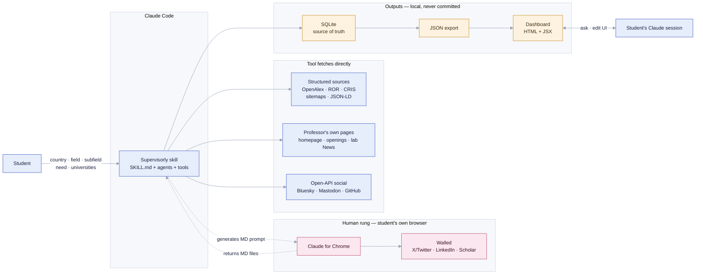
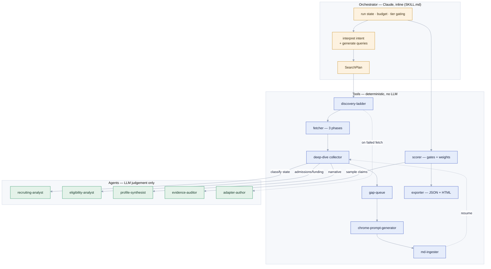
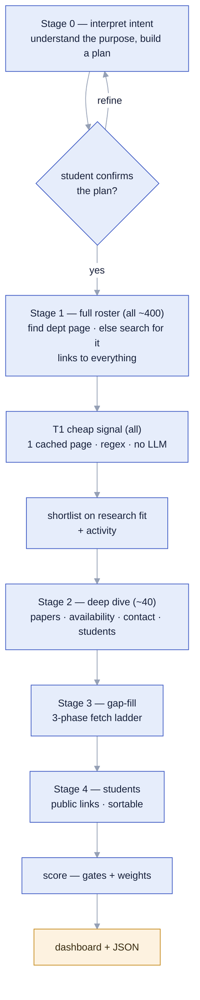
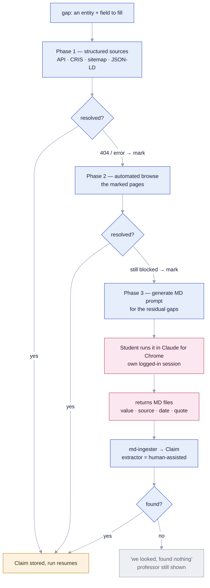
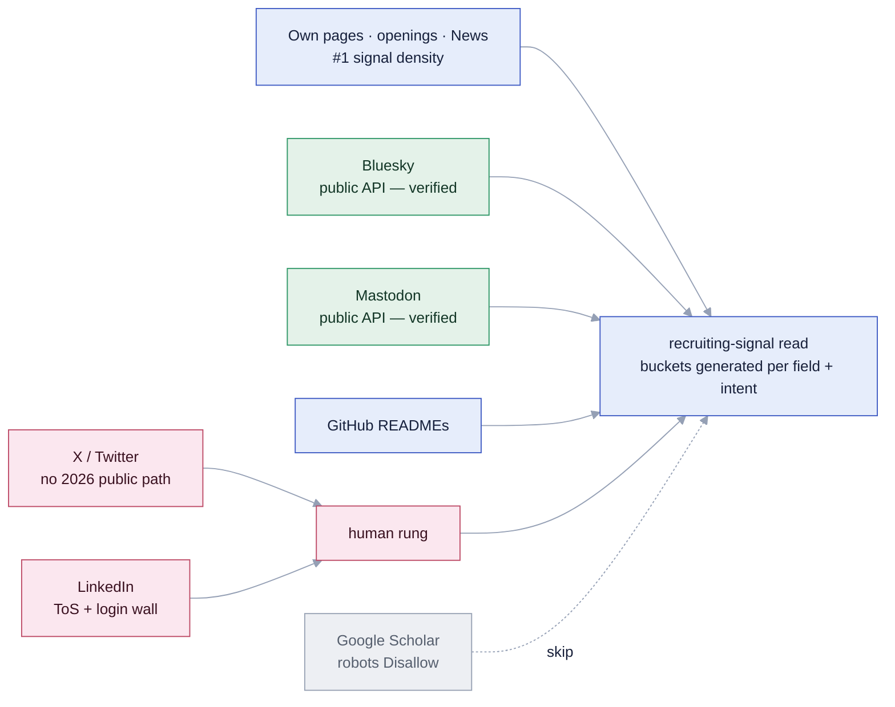
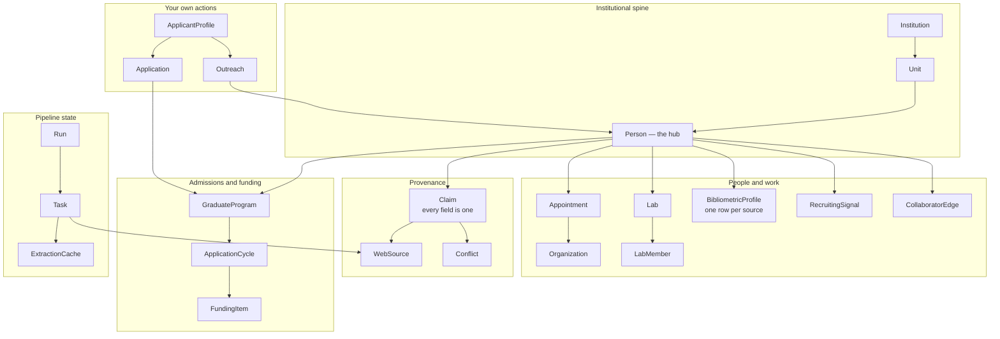
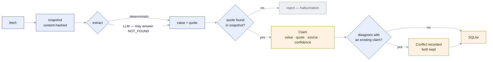
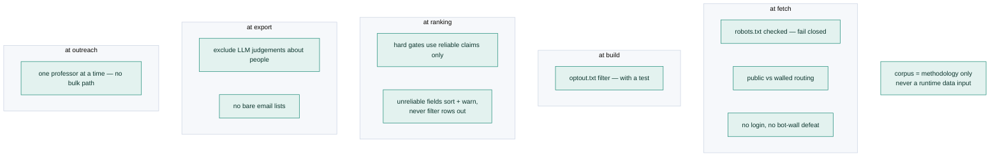
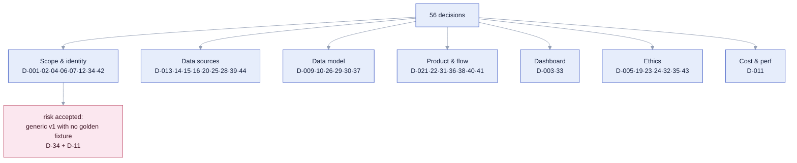

# Supervisorly — Design Atlas

One place that connects everything: the skill, its agents and tools, the pipeline, the
three-phase fetch with its human rung, the data model, the claim/provenance lifecycle, the
rules, and how the 56 decisions cluster. Each map ends with the documents and decisions that
govern it.

**Colour key** — the diagrams use one consistent scheme:

| Colour | Means |
|---|---|
| **Indigo** | the tool fetches or does this automatically |
| **Rose** | the human rung — the student's own browser (Claude for Chrome) |
| **Grey** | skipped on purpose |
| **Amber** | a data store or artifact |
| **Green** | verified / reliable |
| **Teal** | a rule / enforcement gate |

---

## CONTEXT — the boundary of the tool

What Supervisorly is, and where the line runs between what the tool does and what the
student's own browser does.

*The tool reads public pages and open APIs; it never defeats a login. Everything walled is
reached by the human, in their own session.* — architecture.md · D-039 · D-042 · D-044

---

## COMPONENTS — skill, tools, and agents

The deliverable is a skill package. `SKILL.md` orchestrates deterministic **tools** (no LLM)
and, where genuine judgement is needed, **agents** (LLM). Everything writes to SQLite; nothing
returns prose to the orchestrator.

*Intent interpretation and query generation are done by the orchestrator (Claude) inline — they
are the "generate, don't look up" judgement — producing a SearchPlan the deterministic tools
consume. Agents are defined by what needs judgement; workers return a task id and status, never
prose.* — architecture.md §4 · D-042 · D-045 · D-055

---

## PIPELINE — the student's journey, in stages

Intent is understood before anything is searched. The shortlist is formed on **research fit**
(cheaply available), not on recruiting status (which only exists after the deep dive).

*A professor is never dropped for missing data — the gap is shown, not hidden.* —
product-flow.md · D-021 · D-022 · D-037

---

## FETCH — three phases and the human rung

The map Ahmed emphasised. Each phase runs across the target set, marks its failures, and hands
only the residual to the next. Phase 3 is his original Chrome-extension method, turned into the
tool's escape hatch.

*The run carries an `awaiting_human_input` status so Phase 3 can span sessions and resume
without re-fetching.* — architecture.md §2 · D-039 · D-043

---

## SOURCES — where recruiting signal comes from

Verified 2026-07-23. Recruiting status lives in prose on the professor's own channels.
Everything reachable feeds one generated recruiting-signal read.

*The reading method — which phrases signal recruiting, how negation and cycle-dating are
handled — is generated, never a hardcoded keyword list.* — research/social-sources.md · D-038 · D-044

---

## DATA — the core of the model

The spine that lets facts join, dedupe and diff — the thing the corpus's prose files could not
do. 31 entities in total (24 world-model + 7 pipeline/user-action); the core is shown.

*Nothing is keyed on a display name; identity is an internal id with external ids as evidence.
Bibliometrics is one row per source — never a blended number.* — domain-model.md · D-026 · D-030

---

## PROVENANCE — how a value becomes a trusted claim

Every fact carries its source, its quote, and its confidence. Verification is structural — the
model's quote must be found in the stored snapshot — not a prose promise.

*Verification proves fidelity, not truth — that the model didn't invent text relative to the
page. The page itself can still be wrong or stale.* — architecture.md §3 · D-010 · D-043

---

## RULES — where each rule actually bites

Rules are enforced in code at specific points, not asserted in a preamble. This is the map of
enforcement gates.

*Nationality never gates visibility. Scale is an ethical constraint, not just a performance
one.* — ethics-and-compliance.md · D-005 · D-023 · D-024 · D-032 · D-035

---

## DECISIONS — how the 56 cluster

Every decision belongs to one of seven themes. This shows the shape of the design space, and
which clusters still carry the most risk. (56 decisions after the pre-build audit round; the
map names representative ones per theme, not all.)

*The one flagged risk: fully-generic v1 (D-034) without a corpus-sourced regression fixture
(D-011/D-035). Managed by fail-loud coverage, per-value confidence, and cassette + synthetic
tests.* — DECISIONS.md

---

*This atlas is a view over the design documents, not a replacement for them. When a diagram and
a document disagree, the document wins — tell me and I'll fix the diagram.*
